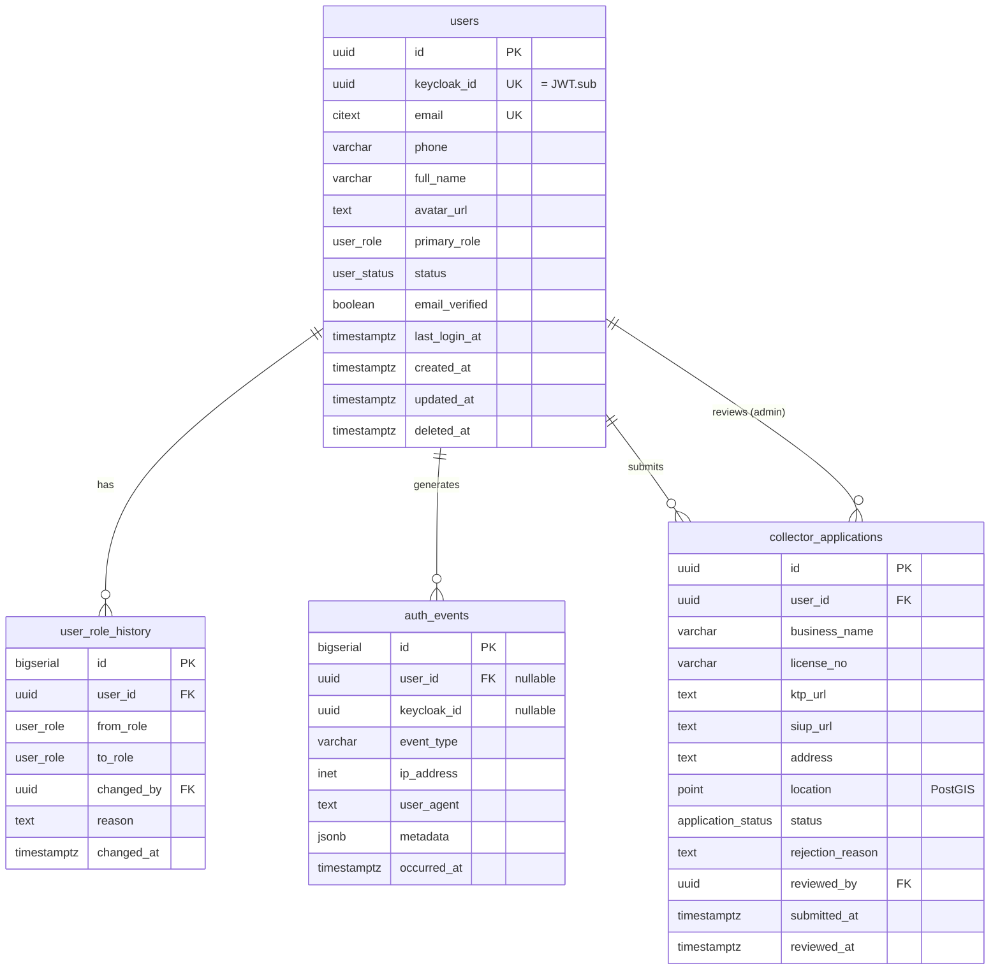

# Spec 0002 — Data Model

## ERD



## Tabel `users`

Sumber kebenaran profil user di Setor.in. Email & password dikelola Keycloak.

| Kolom | Tipe | Constraint | Keterangan |
|---|---|---|---|
| `id` | UUID | PK, default `uuid_generate_v4()` | ID lokal Setor.in |
| `keycloak_id` | UUID | NOT NULL, UNIQUE | Sama dengan JWT `sub` |
| `email` | CITEXT | NOT NULL, UNIQUE | Case-insensitive, mirror dari Keycloak |
| `phone` | VARCHAR(20) | UNIQUE, nullable | Format E.164: +62812... |
| `full_name` | VARCHAR(120) | NOT NULL | Display name |
| `avatar_url` | TEXT | nullable | S3 URL |
| `primary_role` | `user_role` enum | NOT NULL, default `'user'` | Role utama untuk display |
| `status` | `user_status` enum | NOT NULL, default `'pending_verification'` | Lifecycle status |
| `email_verified` | BOOLEAN | NOT NULL, default FALSE | Mirror dari Keycloak |
| `last_login_at` | TIMESTAMPTZ | nullable | Updated tiap call /auth/sync |
| `created_at` | TIMESTAMPTZ | NOT NULL, default NOW() | |
| `updated_at` | TIMESTAMPTZ | NOT NULL, default NOW() | Trigger update |
| `deleted_at` | TIMESTAMPTZ | nullable | Soft delete |

### Enum types

```sql
CREATE TYPE user_role AS ENUM ('user', 'collector', 'admin', 'super_admin');
CREATE TYPE user_status AS ENUM (
  'pending_verification',  -- baru register, belum verify email
  'active',                -- normal
  'suspended',             -- di-suspend admin (sementara)
  'deleted'                -- soft deleted (dengan deleted_at)
);
```

### Index
- `idx_users_keycloak_id` (keycloak_id) — lookup utama saat JWT validation
- `idx_users_email` (email) WHERE deleted_at IS NULL — login lookup
- `idx_users_status` (status) WHERE deleted_at IS NULL — admin filter
- `idx_users_primary_role` (primary_role) WHERE deleted_at IS NULL — admin filter

### Catatan desain
- `primary_role` adalah **denormalisasi** untuk performa display. Sumber
  kebenaran roles tetap di JWT (Keycloak realm roles).
- `email` adalah CITEXT (case-insensitive) supaya `Aria@example.com` ==
  `aria@example.com`.
- `deleted_at` soft delete — semua query WAJIB filter `WHERE deleted_at IS NULL`.

---

## Tabel `user_role_history`

Audit trail perubahan role. Append-only.

| Kolom | Tipe | Keterangan |
|---|---|---|
| `id` | BIGSERIAL | PK |
| `user_id` | UUID | FK → users (CASCADE) |
| `from_role` | `user_role` | nullable (untuk register awal) |
| `to_role` | `user_role` | NOT NULL |
| `changed_by` | UUID | FK → users (SET NULL), nullable kalau system |
| `reason` | TEXT | nullable, untuk admin notes |
| `changed_at` | TIMESTAMPTZ | NOT NULL, default NOW() |

### Index
- `idx_role_history_user` (user_id, changed_at DESC)

---

## Tabel `auth_events`

Audit trail event auth. Append-only. Untuk security & analytics.

| Kolom | Tipe | Keterangan |
|---|---|---|
| `id` | BIGSERIAL | PK |
| `user_id` | UUID | FK → users (SET NULL), nullable untuk anonymous events |
| `keycloak_id` | UUID | nullable, dipakai kalau user_id belum ada (event sebelum sync) |
| `event_type` | VARCHAR(40) | NOT NULL, lihat enum di bawah |
| `ip_address` | INET | nullable |
| `user_agent` | TEXT | nullable |
| `metadata` | JSONB | nullable, payload tambahan (mis. error code) |
| `occurred_at` | TIMESTAMPTZ | NOT NULL, default NOW() |

### Event types (di-validate di application layer, bukan DB enum)
- `register_synced` — first sync setelah register di Keycloak
- `login` — successful login (call /auth/sync dengan token valid)
- `logout` — explicit logout
- `token_refresh` — refresh token (kalau backend tahu, otherwise di Keycloak)
- `email_verified` — webhook dari Keycloak (future)
- `password_changed` — webhook dari Keycloak (future)
- `role_changed` — admin promote/demote
- `role_promoted` — naik level (mis. user → collector)
- `role_demoted` — turun level
- `account_suspended` — admin suspend
- `account_unsuspended` — admin unsuspend
- `account_deleted` — soft delete
- `collector_application_submitted`
- `collector_application_approved`
- `collector_application_rejected`
- `failed_auth` — token invalid, role insufficient (untuk security monitoring)

### Index
- `idx_auth_events_user` (user_id, occurred_at DESC) — riwayat per user
- `idx_auth_events_type` (event_type, occurred_at DESC) — query per tipe

### Retention
- Default: keep 1 tahun
- Compliance: tergantung UU PDP final ruling, tentatif 2 tahun
- Strategy: partition by month (phase 2, kalau volume besar)

---

## Tabel `collector_applications`

Application untuk become collector. Flow di [flows.md Flow 6](flows.md).

| Kolom | Tipe | Keterangan |
|---|---|---|
| `id` | UUID | PK |
| `user_id` | UUID | FK → users (CASCADE), NOT NULL |
| `business_name` | VARCHAR(120) | NOT NULL |
| `license_no` | VARCHAR(40) | nullable |
| `ktp_url` | TEXT | NOT NULL, S3 URL |
| `siup_url` | TEXT | nullable, S3 URL |
| `address` | TEXT | NOT NULL |
| `location` | GEOGRAPHY(POINT, 4326) | nullable, untuk geo-search nanti |
| `status` | `application_status` enum | NOT NULL, default `'pending'` |
| `rejection_reason` | TEXT | nullable |
| `reviewed_by` | UUID | FK → users (SET NULL), nullable |
| `submitted_at` | TIMESTAMPTZ | NOT NULL, default NOW() |
| `reviewed_at` | TIMESTAMPTZ | nullable |

### Enum
```sql
CREATE TYPE application_status AS ENUM ('pending', 'approved', 'rejected');
```

### Constraints
- Partial UNIQUE INDEX: hanya 1 application `pending` per user
  ```sql
  CREATE UNIQUE INDEX idx_one_pending_application
    ON collector_applications(user_id) WHERE status = 'pending';
  ```

---

## Mapping Keycloak ↔ Local DB

| Keycloak | Local DB |
|---|---|
| `sub` (UUID) | `users.keycloak_id` |
| `email` | `users.email` (mirror, sumber kebenaran di Keycloak) |
| `email_verified` | `users.email_verified` (sync saat login) |
| `given_name + family_name` | `users.full_name` (concatenated saat sync) |
| `realm_access.roles` | **TIDAK disimpan di DB** — sumber kebenaran JWT |
| Custom attribute `db_user_id` | Untuk caching `users.id` di token (future) |

**Aturan emas:**
- DB Setor.in **tidak pernah** mirror password
- DB Setor.in **boleh** mirror email/full_name untuk denormalisasi (display)
- JWT adalah **source of truth** untuk roles per request
- Kalau email di Keycloak diubah, harus ada job sync (phase 2 — webhook
  Keycloak event listener)

---

## Relasi ke modul lain (preview, akan di-spec terpisah)

```
users 1—N addresses           (modul `user` extended)
users 1—1 wallets             (modul `wallet`)
users 1—N orders              (modul `order`, sebagai seller)
users 1—N orders              (modul `order`, sebagai collector via collector_id)
users 1—N notifications       (modul `notification`)
collector_applications 1—1 collectors (modul `collector`, setelah approval)
```

---

## Migration files

| File | Sprint | Status |
|---|---|---|
| `00001_create_users.sql` | 0002-auth | Sprint ini |
| `00002_create_auth_audit.sql` | 0002-auth | Sprint ini |
| `00003_create_collector_applications.sql` | 0002-auth | Sprint ini (kalau scope sempat) |
| `00004_create_addresses.sql` | future (modul user extended) | — |
| `00005_create_wallets.sql` | future (modul wallet) | — |
| ... | | |

Lihat [../adr/0004-postgres-goose-sqlc.md](../adr/0004-postgres-goose-sqlc.md) untuk
naming convention.
