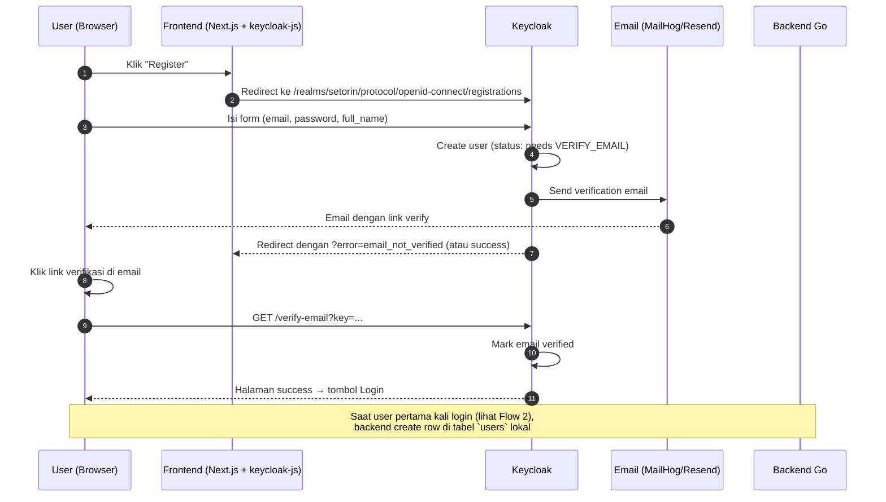
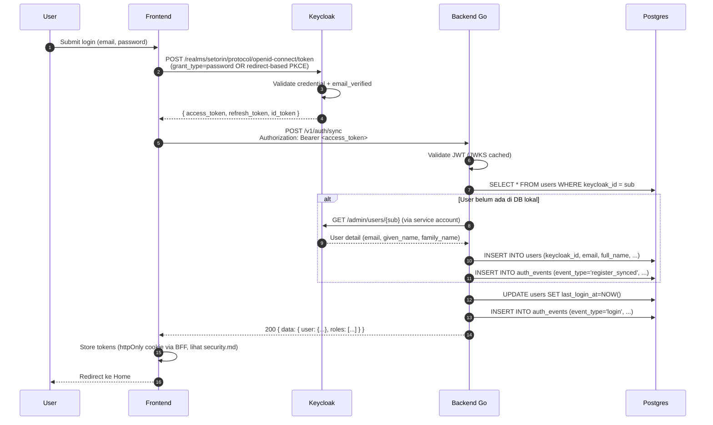
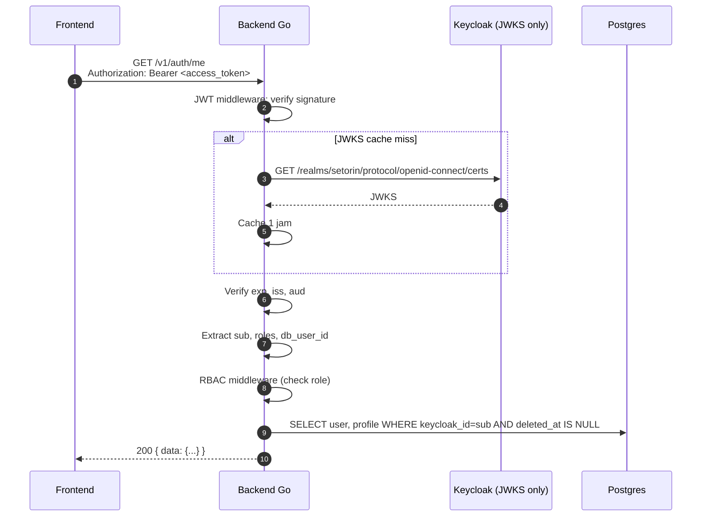
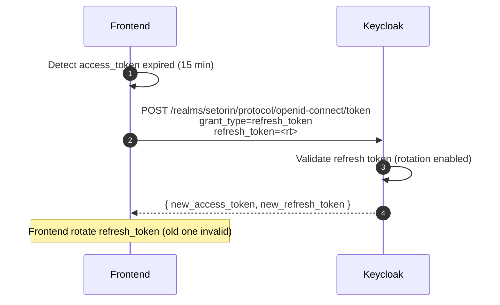
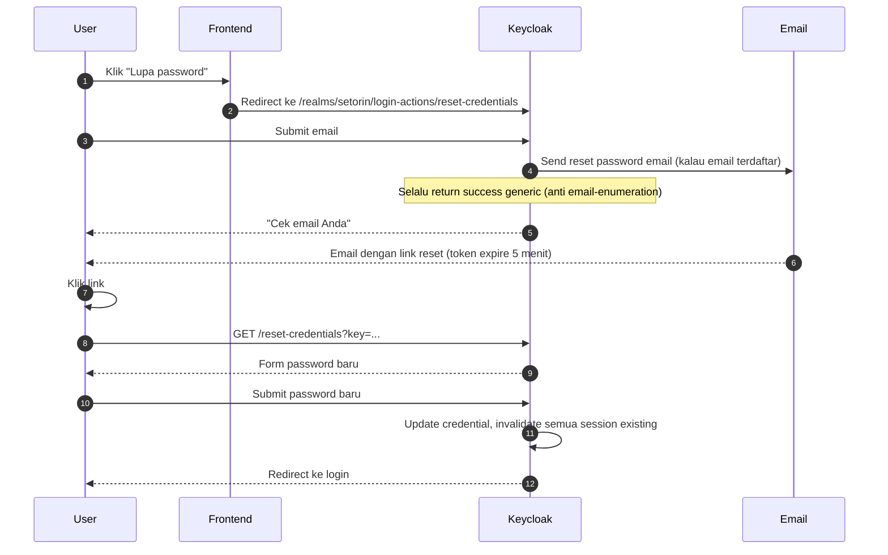
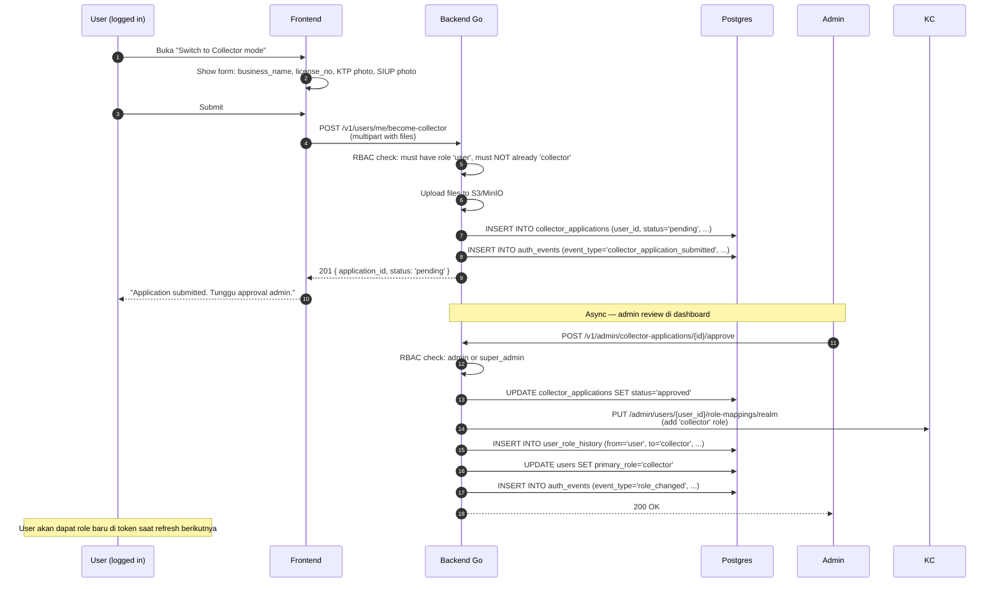
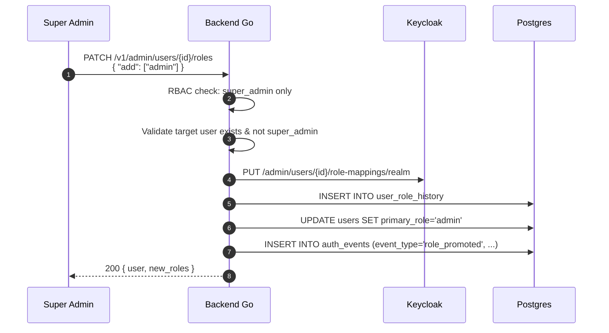
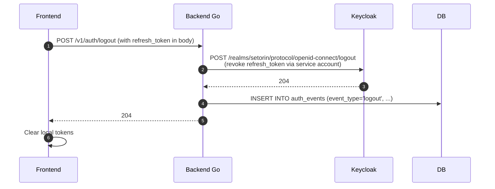

# Spec 0002 — Auth Flows (Sequence Diagrams)

Semua diagram pakai Mermaid. Render di Github / VS Code Mermaid preview.

---

## Flow 1 — Register

**Edge cases:**
- Email sudah terdaftar → Keycloak return error, frontend show "email already exists"
- Password tidak memenuhi policy → Keycloak return validation error
- Email gagal terkirim (SMTP down) → user belum bisa login, ada tombol "resend email" di Keycloak

---

## Flow 2 — Login (first time after verify)

**Edge cases:**
- Email belum verified → Keycloak return 401 dengan `error=invalid_grant` & `error_description` mengandung "verify"
- User suspended di Keycloak → 401
- Token valid tapi user di-soft-delete di DB lokal (`deleted_at IS NOT NULL`) → `/v1/auth/sync` return 403 `ACCOUNT_DEACTIVATED`

---

## Flow 3 — Authenticated request (subsequent)

---

## Flow 4 — Token refresh

**Edge cases:**
- Refresh token expired (>7 hari) → user harus login ulang
- Refresh token reused (replay) → Keycloak invalidate seluruh session

---

## Flow 5 — Forgot password

**Edge cases:**
- Email tidak terdaftar → tetap return success (anti enumeration), tapi tidak ada email terkirim
- Link expired → tampilkan "link kadaluarsa, request ulang"

---

## Flow 6 — Become collector (request)

**Edge cases:**
- User sudah punya role collector → 409 Conflict
- Application pending sudah ada → 409 Conflict (1 application aktif per user)
- Reject → status `rejected`, user bisa apply ulang setelah X hari

---

## Flow 7 — Admin promote user → admin (super_admin only)

---

## Flow 8 — Logout

---

## Notes

- **Semua flow yang melibatkan email** → di dev MailHog (port 8025 UI, 1025 SMTP)
- **JWKS cache TTL** → 1 jam, tapi dengan force refresh kalau ketemu `kid`
  unknown (handle key rotation)
- **Clock skew tolerance** → 60 detik untuk `exp` dan `nbf`
- **Audit log** dipanggil di tiap flow yang signifikan — implementasi via
  decorator/middleware di usecase layer
